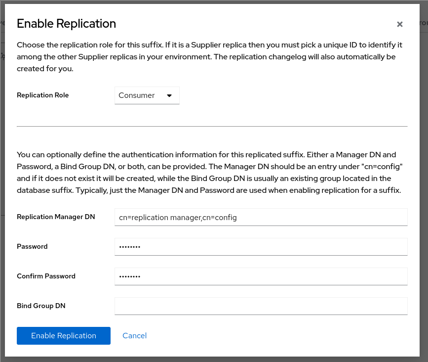

# LDAP Lab 
## deployment Lap environment

# Requirements

Following requirements are necessary upfront to ensure a smooth experience with the Lab

 - podman
 - internet access when bootstrapping
 - a git repository access able through https
 - registry credentials to pull various images
 - superuser privileges as kind-k8s doesn't work well with rootless deployments
 - firewalld needs to be disabled

ensure, you have been successfully logged in to following registries (using the default image set)
- quay.io
- docker.io

```
# please use your approriate credentials for the registries 
for registry in quay.io docker.io ; do 
    podman login ${registry}
done 
```

### Setup and prepare the system 

install the required packages

```
dnf install -y podman git
```

adjust inotify settings of the system to spawn a cluster and workload
```
cat <<EOF> /etc/sysctl.d/kind.conf
fs.inotify.max_user_instances = 12800
fs.inotify.max_user_watches = 21155100
EOF
sysctl -p /etc/sysctl.d/kind.conf
```
disable firewalld to not conflict with crio rules

```
systemctl disable --now firewalld
```
download the binaries to utilize kind (k8s), oc/kubectl (mgmt), kustomize (build/verify)
```
curl -o/usr/bin/kind -L -s https://github.com/kubernetes-sigs/kind/releases/download/v0.17.0/kind-linux-amd64
chmod +x /usr/bin/kind
curl -L -o- https://mirror.openshift.com/pub/openshift-v4/clients/ocp/latest/openshift-client-linux.tar.gz | tar -xzf- -C /usr/bin oc kubectl
chmod +x /usr/bin/{oc,kubectl}
curl -L -o- https://github.com/kubernetes-sigs/kustomize/releases/download/kustomize%2Fv5.0.0/kustomize_v5.0.0_linux_amd64.tar.gz | tar -xzf- -C /usr/bin/ kustomize
chmod +x /usr/bin/kustomize
```
### Clone the repository 

clone the repository from https://github.com/michaelalang/quay-ldap-lab.git to your local file system

```
git clone https://github.com/michaelalang/quay-ldap-lab.git
```

### Bootstrap the k8s kind cluster

the configuration of the Cluster is defined in the file `quay-ldap-lab.yml`. If you want to have more or less Nodes, adjusting the configuration can be done.
One mandatory item to be modified is the `apiServerAddress`. This should point to your primary interface IP address to ensure the bootstrap process on joining Nodes will succeed.
```
API=$(hostname -i)
# or you preferred listen Address
cd quay-ldap-lab
sed -i -e " s#apiServerAddress: 127.0.0.1#apiServerAddress: ${API}#; " quay-ldap-lab.yml
kind create cluster --config quay-ldap-lab.yml
```
#### deploy the necessary services to the k8s cluster
##### metallb for ingress connectivity

deploy the controller

```
oc create -k apps/metallb/base 
oc -n metallb-system wait --for condition=Ready pods -l component=speaker --timeout=300s
```
now edit the IPAddressPool values for your API Address on which you want to connect to for services exposed

```
apiVersion: metallb.io/v1beta1
kind: IPAddressPool
metadata:
  name: example
  namespace: metallb-system
spec:
  addresses:
  - 192.168.0.1-192.168.0.1
```
add the CR to finish the metallb deployment

```
oc -n metallb-system create -f apps/metallb/variants/default/IPAddressPool.yml
```
##### cert-manager for certificates 
next, we want the Cert-Manager to be deployed as other deployments might require a Certificate and would need a restart to pick up a later deployed Certificate
```
oc create -k apps/cert-manager/base/
oc -n cert-manager wait --for condition=Ready pods -l app.kubernetes.io/instance=cert-manager --timeout=300s
```

##### traefik as ingress controller
for the Lab purpose, only the following names are registered in the Certificates:
* ds389-001.example.com
* ds389-002.example.com

Feel free to adjust or extend the names accordingly in the file `apps/traefik/variants/default/certificate.yml`. Afterwards deploy the ingress controller
```
oc create -k apps/traefik/variants/default/
oc -n kube-system wait --for condition=Ready pods -l app.kubernetes.io/name=traefik --timeout=300s
```

if you want to avoid the Security warnings you can extract the ingress certificates and use them accordingly

```
oc -n kube-system extract secret/traefik-ingress-ssl
# alternative you can add ds389-001.example.com and ds389-002.example.com to your /etc/hosts file
curl --cacert ca.crt --resolv ds389-001.example.com:443:127.0.0.1 https://ds389-001.example.com
404 page not found
```

##### Istio as ServiceMesh controller
Istio provides a ServiceMesh to our cluster. The ingress will provide functionality to access the Console for our LDAP services in a simple manner.

```
oc apply -k apps/istio/variants/default/
```

with delegating all SSL SNI ingress to Istio, we need to utilize those Certificates now

**NOTE**: until the `istio-ingressgateway` is available, the certificate will not match as it will be handled by traefik.
```
oc -n istio-system extract secret/frontend-gateway --confirm
# alternative you can add ds389-001.example.com and ds389-002.example.com to your /etc/hosts file
curl -I --cacert tls.crt --resolv ds389-001.example.com:443:127.0.0.1 https://ds389-001.example.com
HTTP/2 404 
date: Sun, 23 Apr 2023 19:37:34 GMT
server: istio-envoy
```

##### deploy the LDAP instances for the Lab

the LDAP deployment consists of two LDAP instances. Each separated into it's own namespace.
```
oc create -k apps/ds389/variants/001
oc create -k apps/ds389/variants/002
```
##### our tool workbench 
to simplify access and make resolution Lab persistent, we utilize a tool image that has various ldap tools included
* openldap-clients
* python3-ldap
* python3-ldap3
* ldapvi
* git
* wireshark-cli
* man
* 389-ds-base
start a session as follows

```
# alternatively you can as well use the ds389-002 namespace

oc -n ds389-001 create -f apps/ds389/base/tools.yml
oc -n ds389-001 wait --for condition=Ready deploy/tools --timeout=300s
oc -n ds389-001 exec -ti deploy/tools -- /bin/bash
```

**NOTE**:
* The following exercises are expected to be executed within a `tools` container instance.
* All passwords are set to the string `changeme`
* Cockpit instances are available at
  * https://ds389-001.example.com
  * https://ds389-002.example.com
* if you get logged out of Cockpit use the credentials `root` : `changeme`
* Your workstation needs to resolve the example.com names to the configured Ingress IP of the k8s cluster
* All queries and references to attribute values are randomized. You need to adjust the values accordingly
  * `uid=r*` or `uid=re*`
  *  `cn=Michael Moore,ou=People,dc=example,dc=com`


## basic LDAP search queries
`ldapsearch` is the tool we want to familiarize with as it's the most commonly used when looking up and or debugging LDAP records. An LDAP search requires following items:
* ldapuri or host+port
* binddn + bindpwd or anonymous authentication
* basedn

further more following will be added if not specified:
* a filter
* attribute list to return

let's start with the first query
```
ldapsearch -x -H ldap://ds389-001.ds389-001.svc:10389 \
                    -b 'dc=example,dc=com' \
                    -D 'cn=Directory Manager' \
                    -w 'changeme'
```
it's a good practice to always quote the items that might have a space inside (base, dn's, filters) but you can as well escape spaces like
```
ldapsearch -x -H ldap://ds389-001.ds389-001.svc:10389 \
                    -b 'dc=example,dc=com' \
                    -D 'cn=Directory Manager' \
                    -w 'changeme'

ldapsearch -x -H ldap://ds389-001.ds389-001.svc:10389 \
                    -b dc=example,dc=com \
                    -D cn=Directory\ Manager \
                    -w 'changeme'
```
our examples so far used `authenticated binds` which are specified by the `-D` option and passwords can be specified as `-w` or `-W` if you want it to be prompted.

### understanding filters
filtering is the the essence on what we want to retrieve and match against. You might have been wondering on case sensitivity for queries and filters. In most cases, queries are case insensitive but this is defined by the LDAP schema for each attribute individually
```
attributeTypes: ( 0.9.2342.19200300.100.1.1 
        NAME ( 'uid' 'userid' )  
        EQUALITY caseIgnoreMatch SUBSTR caseIgnoreSubstringsMatch 
        SYNTAX 1.3.6.1.4.1.1466.115.121.1.15 
        X-ORIGIN
        'RFC 4519' 
        X-DEPRECATED 'userid' 
)
```
as you can see, the Attribute `uid` (userid is deprecated) can be search case insensitive as well as matching parts of the string. This might be a useful information if we query for a `glob` of people starting with `name` or expect a particular entry not to be returned
**NOTE**: the parameter `-LLL` removes the noise comments from the ldapsearch command and is typically used to create ldif file content.
```
ldapsearch -x -H ldap://ds389-001.ds389-001.svc:10389 \
           -b 'dc=example,dc=com' \
           -D  'cn=Directory Manager' \
           -w 'changeme' \
           -LLL \
           'uid=r*' \
           uid 
dn: cn=Kenneth Robles,ou=People,dc=example,dc=com
uid: reedcynthia

dn: cn=James Nolan,ou=People,dc=example,dc=com
uid: reyesmelissa

dn: cn=Tiffany Berg,ou=People,dc=example,dc=com
uid: royjames
```
we did expect that only two records are returned but received three so we can limit our matching further
```
ldapsearch -x -H ldap://ds389-001.ds389-001.svc:10389 \
           -b 'dc=example,dc=com' \
           -D  'cn=Directory Manager' \
           -w 'changeme' \
           -LLL \
           'uid=re*' \
           uid 
dn: cn=Kenneth Robles,ou=People,dc=example,dc=com
uid: reedcynthia

dn: cn=James Nolan,ou=People,dc=example,dc=com
uid: reyesmelissa
```
you might question if that matters during authentication and the answer to that is, it depends :)
There are multiple ways to authenticate users against LDAP. My personal opinion is that `bind authentication` are more preferable than `search authentication`. Reason for that is that it costs more in sense of resources to search than to bind directly as we should already know the `dn` to be used.
So *pseudo* code differences would look like
```
# bind authentication
try:
    connection = ldap.Connection(ldapServer)
    connection.bind('uid=user,ou=people,dc=example,dc=com',
                    'password')
exception InvalidCredentials:
    return AuthenticationFailed()
# vs search authentication      
try:
    connection = ldap.Connection(ldapServer)
    connection.bind('cn=Directory Manager',
                    'password')
    connection.search(baseDN, filter='(uid=user)')
    for entry in connection.entries:
            try:
                    connection.bind(entry.dn,
                                    password)
                    return Success()
                except InvalidCredentials:
                    pass
                returm AuthenticationFailed()
exception InvalidCredentials:
    return AuthenticationFailed()                    
```
as seen before, the `uid` Attribute might return multiple records so you would need to iterate over all returned items to ensure that `overlapping` uid's (rob, robert, roberto) will be authenticated correctly (assuming that the have different passwords) as well as in large Directories, the query might cost a lot.

#### combining multiple filters 
as discussed previously, specifying very exact filters is beneficial to avoid returning wrong results. Filters are evaluated always in boolean, key-value pairs so that chaining will get *messy* for reading when having a lot of filters chained.
```
# simple filter for entries with objectClass == person
(objectClass=person)

# chaining previous filter with uid == user
(&(objectClass=person)(uid=user))

# chaining previous filter with uid == user or uid == user 1
(&(objectClass=person)(|(uid=user)(uid=user1)))

# chaining previous filter with organizationUnit == IT
(&(&(objectClass=person)(|(uid=user)(uid=user1)))(ou=IT))

# chaining previous filter with Department == LDAP
(&(&(&(objectClass=person)(|(uid=user)(uid=user1)))(ou=IT))(department=LDAP))

# chaining previous filter with and has no commonName attribute
(&(&(&(&(objectClass=person)(|(uid=user)(uid=user1)))(ou=IT))(department=LDAP))(!(cn=*)))
```

Negation of a filter needs to be always expressed as
```
(&(uid=user)(!(objectClass=Person)))
```
which get's evaluated as
* uid == user
* AND
* objectClass=Person == True
* NOT

###  quay specific filters 
Red Hat Quay LDAP integration considers:
* authentication of Users
* mapping of ldap Groups to Quay groups

**NOTE**: the word `group` in Quay/LDAP does not necessarily refer to a group as understood in posix or Windows Systems.

The word `filtering` instead if `grouping` will be more accurate to understand, what Quay is expecting.

#### authenticating Users in Quay through LDAP
the interesting configuration parameters for Quay (v3.7,v3.8) are:
* AUTHENTICATION_TYPE
* LDAP_ADMIN_DN
* LDAP_ADMIN_PASSWD
* LDAP_ALLOW_INSECURE_FALLBACK
* LDAP_BASE_DN
* LDAP_EMAIL_ATTR
* LDAP_SECONDARY_USER_RDNS
* LDAP_UID_ATTR
* LDAP_URI
* LDAP_USER_RDN
* LDAP_SUPERUSER_FILTER (v3.8)
* LDAP_RESTRICTED_USER_FILTER (v3.8)

From what we have seen so far, we should be able to fill out the appropriate parameters at ease
```
AUTHENTICATION_TYPE: LDAP
LDAP_ADMIN_DN: cn=Directory Manager
LDAP_ADMIN_PASSWD: "changeme"
LDAP_ALLOW_INSECURE_FALLBACK: false
LDAP_BASE_DN:
  - dc=example
  - dc=com
LDAP_EMAIL_ATTR: mail
LDAP_SECONDARY_USER_RDNS:
  - ou=People
LDAP_UID_ATTR: uid
LDAP_URI: ldap://ds389-001.ds389-001.svc:10389
LDAP_USER_RDN:
  - ou=People
```
the array style notation of a `dn` is Quay specific through the `yaml` syntax.
As we configure the `uid` and the `mail` being the Attribute to `match` on the entered username in various tools or the UI, you need to lookup those for authenticating correctly. Other attributes like `sAMAccountName` are typical for Windows Active directory. Bear in mind that we did not setup any `mail` attribute capable `objectClass` so using this attribute will not be possible right now.

The v3.8 introduced LDAP based `LDAP_SUPERUSER_FILTER` and `LDAP_RESTRICTED_USER_FILTER` are named correctly but misunderstood as `grouping` by many people as the filter most of the time will be applied like `cn=group,ou=Groups,dc=example,dc=com`

in most of the actual LDAP Server implementations, there is a possibility to change lookups from:
* in group xyz, get me all members
* user xzy, which groups are you a member of

this is typically done through the `memberOf` Attribute on the corresponding User LDAP object.
Example:
```
ldapsearch -x -H ldap://ds389-001.ds389-001.svc:10389 \
              -D 'cn=Directory Manager' \
              -w 'changeme' \
              -b 'cn=Michael Moore,ou=People,dc=example,dc=com' \
              -LLL \
              uid memberof 
dn: cn=Michael Moore,ou=People,dc=example,dc=com
uid: awagner
memberof: cn=schwartz-plc,ou=Groups,dc=example,dc=com
memberof: cn=allusers,ou=Groups,dc=example,dc=com
```
the returned record in the Example tells us that the User is a member of the Groups/Organization
* cn=schwartz-plc,ou=Groups,dc=example,dc=com
* cn=allusers,ou=Groups,dc=example,dc=com

Even though the Lab does not provide any entry in `ou=groups,dc=example,dc=com` we can declare membership for Quay in that way for example adding the User to the superuser group we configure as filter in Quay's config.yaml
```
ldapmodify -x -H ldap://ds389-001.ds389-001.svc:10389 \
              -D 'cn=Directory Manager' \
              -w 'changeme' 
dn: cn=Michael Moore,ou=People,dc=example,dc=com
changetype: modify
add: memberOf
memberOf: cn=quay-superuser,ou=Groups,dc=example,dc=com

```
rechecking the entry now would return
```
ldapsearch -x -H ldap://ds389-001.ds389-001.svc:10389 \
              -D 'cn=Directory Manager' \
              -w 'changeme' \
              -b 'cn=Michael Moore,ou=People,dc=example,dc=com' \
              -LLL \
              uid memberof
dn: cn=Michael Moore,ou=People,dc=example,dc=com
uid: awagner
memberof: cn=schwartz-plc,ou=Groups,dc=example,dc=com
memberof: cn=allusers,ou=Groups,dc=example,dc=com
memberof: cn=quay-superuser,ou=Groups,dc=example,dc=com
```
our Quay config.yaml `LDAP_SUPERUSER_FILTER` can be defined as

```
LDAP_SUPERUSER_FILTER: (memberOf=cn=quay-superuser,ou=Groups,dc=example,dc=com)
```
for the `LDAP_RESTRICTED_USER_FILTER` we have an open BUG as Product management states, that superusers shall not be restricted which in the current version, they are.

Lets try to configure a `LDAP_RESTRICTED_USER_FILTER` with the already learned and seen filter methods to mitigate the problem.
* We want all Users with the attribute `memberOf: cn=allusers,ou=Groups,dc=example,dc=com` to be restricted
* We want all Users with the attribute `memberOf: cn=quay-superuser,ou=Groups,dc=example,dc=com` to be excluded

```
LDAP_RESTRICTED_USER_FILTER: (&(memberOf=cn=allusers,ou=Groups,dc=example,dc=com)(!(memberOf=cn=quay-superuser,ou=Groups,dc=example,dc=com)))
```
We have a yet still fairly simple query (AND, NOT) that provides the required definition. Verify this with an ldapsearch query
```
# All users that are restricted
# no line breaks in filter possible !!!
ldapsearch -x -H ldap://ds389-001.ds389-001.svc:10389 \
                        -D 'cn=Directory Manager' \
                        -w 'changeme' \
                        -b dc=example,dc=com \
                        '(&(memberOf=cn=allusers,ou=Groups,dc=example,dc=com)(!(memberOf=cn=quay-superuser,ou=Groups,dc=example,dc=com)))' \
                        -LLL \
                        uid
dn: cn=Yvonne Porter,ou=People,dc=example,dc=com
uid: dylan36
dn: cn=Kenneth Robles,ou=People,dc=example,dc=com
uid: reedcynthia
dn: cn=John Castaneda,ou=People,dc=example,dc=com
uid: stephanie61
dn: cn=James Nolan,ou=People,dc=example,dc=com
uid: reyesmelissa
dn: cn=Suzanne Joseph,ou=People,dc=example,dc=com
uid: christopherherman
dn: cn=Crystal Gilbert,ou=People,dc=example,dc=com
uid: opatterson
dn: cn=Breanna Cross,ou=People,dc=example,dc=com
uid: jmosley
dn: cn=Nathan Chandler,ou=People,dc=example,dc=com
uid: hrivera
dn: cn=Tiffany Berg,ou=People,dc=example,dc=com
uid: royjames
```
versus all users not restricted
```
# we need to remove the negotiation in the Filter
# no line breaks in filter possible !!!
ldapsearch -x -H ldap://ds389-001.ds389-001.svc:10389 \
              -D 'cn=Directory Manager' \
              -w 'changeme' \
              -b dc=example,dc=com \
              '(&(memberOf=cn=allusers,ou=Groups,dc=example,dc=com)(memberOf=cn=quay-superuser,ou=Groups,dc=example,dc=com))' \
              -LLL \
              uid
dn: cn=Michael Moore,ou=People,dc=example,dc=com
uid: awagner
```

**HINT**: For Red Hat Directory Server (or upstream ds389) specific, there is a plugin called `memberof` that will automatically manage the values of the `memberOf` Attribute when Users are associated with an LDAP group.

#### teamSync configuration in LDAP for Quay

Let us configure our LDAP instance to utilize the `memberof` Plugin to manage the `memberOf` attribute values if we add people to a `Basic Group` in LDAP. Compared to `Posix Group` in LDAP the basic does not carry any posix Attributes required to use it similar to `/etc/group`

First enable the `memberof` plugin
```
ldapmodify -x -H ldap://ds389-001.ds389-001.svc:10389 \
              -D 'cn=Directory Manager' \
              -w 'changeme' 
dn: cn=MemberOf Plugin,cn=plugins,cn=config
changetype: modify
replace: nsslapd-pluginEnabled
nsslapd-pluginEnabled: on

```
Second, this plugin requires that we restart the LDAP service
```
oc -n ds389-001 rollout restart deploy/ds389-001
```

Let's create the appropriate Groups in our Directory
```
ldapadd -x -H ldap://ds389-001.ds389-001.svc:10389 \
           -D 'cn=Directory Manager' \
           -w 'changeme' 
dn: cn=allusers,ou=Groups,dc=example,dc=com
objectClass: top
objectClass: groupOfNames
cn: allusers

dn: cn=quay-superuser,ou=Groups,dc=example,dc=com
objectClass: top
objectClass: groupOfNames
cn: quay-superuser
```
now let's add our existing uids to the `allusers` group by retrieving all uid values

```
ldapsearch -x -H ldap://ds389-001.ds389-001.svc:10389 \
              -D 'cn=Directory Manager' \
              -w 'changeme' \
              -b 'ou=people,dc=example,dc=com' \
              -LLL \
              '(uid=*)' \
              dn | \
              sed -e ' s#dn: ##; ' | \
              awk ' /cn=/ { print "add: member\nmember:",$0,"\n-" } '
add: member
member: cn=Yvonne Porter,ou=People,dc=example,dc=com 
-
add: member
member: cn=Kenneth Robles,ou=People,dc=example,dc=com 
-
add: member
member: cn=John Castaneda,ou=People,dc=example,dc=com 
-
add: member
member: cn=James Nolan,ou=People,dc=example,dc=com 
-
add: member
member: cn=Suzanne Joseph,ou=People,dc=example,dc=com 
-
add: member
member: cn=Crystal Gilbert,ou=People,dc=example,dc=com 
-
add: member
member: cn=Breanna Cross,ou=People,dc=example,dc=com 
-
add: member
member: cn=Nathan Chandler,ou=People,dc=example,dc=com 
-
add: member
member: cn=Tiffany Berg,ou=People,dc=example,dc=com 
-
add: member
member: cn=Michael Moore,ou=People,dc=example,dc=com 
-
```

update the `cn=allusers,ou=Groups,dc=example,dc=com` entry accordingly by copying those values as returned by your search
```
ldapmodify -x -H ldap://ds389-001.ds389-001.svc:10389 \
           -D 'cn=Directory Manager' \
           -w 'changeme' 
dn: cn=allusers,ou=Groups,dc=example,dc=com
changetype: modify
add: member
member: cn=Yvonne Porter,ou=People,dc=example,dc=com 
-
add: member
member: cn=Kenneth Robles,ou=People,dc=example,dc=com 
-
add: member
member: cn=John Castaneda,ou=People,dc=example,dc=com 
-
add: member
member: cn=James Nolan,ou=People,dc=example,dc=com 
-
add: member
member: cn=Suzanne Joseph,ou=People,dc=example,dc=com 
-
add: member
member: cn=Crystal Gilbert,ou=People,dc=example,dc=com 
-
add: member
member: cn=Breanna Cross,ou=People,dc=example,dc=com 
-
add: member
member: cn=Nathan Chandler,ou=People,dc=example,dc=com 
-
add: member
member: cn=Tiffany Berg,ou=People,dc=example,dc=com 
-
add: member
member: cn=Michael Moore,ou=People,dc=example,dc=com 
-
```

Verify our member list with following search
```
ldapsearch -x -H ldap://ds389-001.ds389-001.svc:10389 \
           -D 'cn=Directory Manager' \
           -w 'changeme' \
           -b 'cn=allusers,ou=Groups,dc=example,dc=com' \
           -s base \
           -LLL
dn: cn=allusers,ou=Groups,dc=example,dc=com
objectClass: top
objectClass: groupOfNames
cn: allusers
member: cn=Yvonne Porter,ou=People,dc=example,dc=com
member: cn=Kenneth Robles,ou=People,dc=example,dc=com
member: cn=John Castaneda,ou=People,dc=example,dc=com
member: cn=James Nolan,ou=People,dc=example,dc=com
member: cn=Suzanne Joseph,ou=People,dc=example,dc=com
member: cn=Crystal Gilbert,ou=People,dc=example,dc=com
member: cn=Breanna Cross,ou=People,dc=example,dc=com
member: cn=Nathan Chandler,ou=People,dc=example,dc=com
member: cn=Tiffany Berg,ou=People,dc=example,dc=com
member: cn=Michael Moore,ou=People,dc=example,dc=com
```
the `-s` defines at which `scope` to search and since we specified the full dn of our group, it's enough to specify `base`.
Since the memberOf attribute values have been pre populated we will not see any difference right now.
Next we want to add our `quay-superuser`  group and in addition to our already manually changed User, we pick a random second one to be added.

```
ldapmodify -x -H ldap://ds389-001.ds389-001.svc:10389 \
           -D 'cn=Directory Manager' \
           -w 'changeme' 
dn: cn=quay-superuser,ou=Groups,dc=example,dc=com
changetype: modify
add: member
member: cn=Yvonne Porter,ou=People,dc=example,dc=com 
-
add: member
member: cn=Michael Moore,ou=People,dc=example,dc=com 
-
```
to ensure, our configured groups do match the Users `memberOf` attribute values, we also want to run a `cleanup` task on the `memberof` Plugin
```
oc -n ds389-001 exec -ti deploy/ds389-001 -- dsconf ldap plugin memberof fixup 'dc=example,dc=com'
Attempting to add task entry...
Successfully added task entry
```

now re-check on our `memberOf` attribute values accordingly
```
ldapsearch -x -H ldap://ds389-001.ds389-001.svc:10389 \
              -D 'cn=Directory Manager' \
              -w 'changeme' \
              -b 'ou=People,dc=example,dc=com' \
              '(memberOf=*)' \
              -LLL \
              memberOf
dn: cn=Yvonne Porter,ou=People,dc=example,dc=com
memberOf: cn=quay-superuser,ou=Groups,dc=example,dc=com
memberOf: cn=allusers,ou=Groups,dc=example,dc=com
dn: cn=Kenneth Robles,ou=People,dc=example,dc=com
memberOf: cn=allusers,ou=Groups,dc=example,dc=com
dn: cn=John Castaneda,ou=People,dc=example,dc=com
memberOf: cn=allusers,ou=Groups,dc=example,dc=com
dn: cn=James Nolan,ou=People,dc=example,dc=com
memberOf: cn=allusers,ou=Groups,dc=example,dc=com
dn: cn=Suzanne Joseph,ou=People,dc=example,dc=com
memberOf: cn=allusers,ou=Groups,dc=example,dc=com
dn: cn=Crystal Gilbert,ou=People,dc=example,dc=com
memberOf: cn=allusers,ou=Groups,dc=example,dc=com
dn: cn=Breanna Cross,ou=People,dc=example,dc=com
memberOf: cn=allusers,ou=Groups,dc=example,dc=com
dn: cn=Nathan Chandler,ou=People,dc=example,dc=com
memberOf: cn=allusers,ou=Groups,dc=example,dc=com
dn: cn=Tiffany Berg,ou=People,dc=example,dc=com
memberOf: cn=allusers,ou=Groups,dc=example,dc=com
dn: cn=Michael Moore,ou=People,dc=example,dc=com
memberOf: cn=quay-superuser,ou=Groups,dc=example,dc=com
memberOf: cn=allusers,ou=Groups,dc=example,dc=com
```
as we can now see, the plugin took care that only groups configured are listed in the `memberOf` attribute values and our two `quay-superuser` Objects are listed as well.

### evaluating debug levels
LDAP [provides](https://www.openldap.org/doc/admin24/slapdconfig.html) a lot of debug levels and unfortunately, not all of them are available in ldapsearch.
Still, we can utilize levels **1**, **2**, **4** and **-1** which equals the combined of all available levels.

Use one of the previous chained filters (the more chains the more you'll see) and change the debug level for each query  to see the difference
```
ldapsearch -x -H ldap://ds389-001.ds389-001.svc:10389 \
           -D 'cn=Directory Manager' \
           -w 'changeme' \
           '(&(&(&(&(objectClass=person)(|(uid=user)(uid=user1)))(ou=IT))(department=LDAP))(!(cn=*)))' \
           -d 1

ldapsearch -x -H ldap://ds389-001.ds389-001.svc:10389 \
           -D 'cn=Directory Manager' \
           -w 'changeme' \
           '(&(&(&(&(objectClass=person)(|(uid=user)(uid=user1)))(ou=IT))(department=LDAP))(!(cn=*)))' \
           -d 2

ldapsearch -x -H ldap://ds389-001.ds389-001.svc:10389 \
           -D 'cn=Directory Manager' \
           -w 'changeme' \
           '(&(&(&(&(objectClass=person)(|(uid=user)(uid=user1)))(ou=IT))(department=LDAP))(!(cn=*)))' \
           -d 4

ldapsearch -x -H ldap://ds389-001.ds389-001.svc:10389 \
           -D 'cn=Directory Manager' \
           -w 'changeme' \
           '(&(&(&(&(objectClass=person)(|(uid=user)(uid=user1)))(ou=IT))(department=LDAP))(!(cn=*)))' \
           -d -1
```

## securing LDAP queries/connections
Securing LDAP queries/connections is the preferred way as even though the protocol is raw unreadable, it's just BER+ASN1 encoded. SSL/TLS connections can be established through two ways:
* specifying the Secure LDAP protocol in the URI `ldaps:///`
* use `StartTLS` similar to the `smtp` protocol

```
ldapsearch -x -H ldaps://ds389-001.ds389-001.svc:10636 \
                   -D 'cn=Directory Manager' \
                   -w 'changeme' \
                   -b 'dc=example,dc=com' \
                   -s sub \
                   uid -d -1 2>&1 | grep TLS
TLS trace: SSL_connect:before SSL initialization
TLS trace: SSL_connect:SSLv3/TLS write client hello
TLS trace: SSL_connect:SSLv3/TLS write client hello
TLS trace: SSL_connect:SSLv3/TLS read server hello
TLS trace: SSL_connect:TLSv1.3 read encrypted extensions
TLS trace: SSL_connect:SSLv3/TLS read server certificate request
TLS certificate verification: depth: 2, err: 0, subject: /C=US/O=Internet Security Research Group/CN=ISRG Root X1, issuer: /C=US/O=Internet Security Research Group/CN=ISRG Root X1
TLS certificate verification: depth: 1, err: 0, subject: /C=US/O=Let's Encrypt/CN=R3, issuer: /C=US/O=Internet Security Research Group/CN=ISRG Root X1
TLS certificate verification: depth: 0, err: 0, subject: /CN=*.example.com, issuer: /C=US/O=Let's Encrypt/CN=R3
TLS trace: SSL_connect:SSLv3/TLS read server certificate
TLS trace: SSL_connect:TLSv1.3 read server certificate verify
TLS trace: SSL_connect:SSLv3/TLS read finished
TLS trace: SSL_connect:SSLv3/TLS write change cipher spec
TLS trace: SSL_connect:SSLv3/TLS write client certificate
TLS trace: SSL_connect:SSLv3/TLS write finished
TLS trace: SSL3 alert write:warning:close notify
```

using `StartTLS` on the plain-text protocol port by specifying `-Z` (`-ZZ` makes TLS mandatory and will fail the connection if the server cannot provide TLS or Certificate issues happen eq. Self-signed, SNA mismatch)
```
ldapsearch -x -ZZ -H ldap://ds389-001.ds389-001.svc:10389 \
                   -D 'cn=Directory Manager' \
                   -w 'changeme' \
                   -b 'dc=example,dc=com' \
                   -s sub \
                   uid -d -1 2>&1 | grep TLS
  0000:  01 00 04 00 04 3b 53 74  61 72 74 20 54 4c 53 20   .....;Start TLS   
  0010:  74 20 54 4c 53 20 72 65  71 75 65 73 74 20 61 63   t TLS request ac  
res_errno: 0, res_error: <Start TLS request accepted.Server willing to negotiate SSL.>, res_matched: <>
TLS trace: SSL_connect:before SSL initialization
TLS trace: SSL_connect:SSLv3/TLS write client hello
TLS trace: SSL_connect:SSLv3/TLS write client hello
TLS trace: SSL_connect:SSLv3/TLS read server hello
TLS trace: SSL_connect:TLSv1.3 read encrypted extensions
TLS certificate verification: depth: 2, err: 0, subject: /C=US/O=Internet Security Research Group/CN=ISRG Root X1, issuer: /C=US/O=Internet Security Research Group/CN=ISRG Root X1
TLS certificate verification: depth: 1, err: 0, subject: /C=US/O=Let's Encrypt/CN=R3, issuer: /C=US/O=Internet Security Research Group/CN=ISRG Root X1
TLS certificate verification: depth: 0, err: 0, subject: /CN=*.example.com, issuer: /C=US/O=Let's Encrypt/CN=R3
TLS trace: SSL_connect:SSLv3/TLS read server certificate
TLS trace: SSL_connect:TLSv1.3 read server certificate verify
TLS trace: SSL_connect:SSLv3/TLS read finished
TLS trace: SSL_connect:SSLv3/TLS write change cipher spec
TLS trace: SSL_connect:SSLv3/TLS write finished
TLS trace: SSL3 alert write:warning:close notify
```

mitigation for SSL or certificate mismatch/self-signed chains are the configuration options for the ldap client located in `/etc/openldap/ldap.conf`
In our Lab we need to add following lines to succeed, This has already been done in the deployment for you.
```
TLS_REQCERT never
TLS_REQSAN never
```

## restricting LDAP queries
LDAP enforces restriction through `ACI` rules. Those are inherited by the parent objects which provides the flexibility to chain them.
Common ACI rules might be to `grant` access to all objects in the tree and limit particular sub objects from being retrieved or seen at all.

Our Base setup utilized just one ACI which tells:
* grant read,search and compare access
* to all target Attributes
* to anyone (unauthenticated as well)
```
ldapsearch -x -H ldaps://ds389-001.ds389-001.svc:10636 \
              -b 'dc=example,dc=com' \
              -s base \
              aci
# example.com
dn: dc=example,dc=com
aci: (targetattr="*")(targetfilter="(objectClass=*)")(version 3.0; acl "Enable
  anyone domain read"; allow (read, search, compare)(userdn="ldap:///anyone");
 )
```
we now have two options to limit unauthenticated access by
* writing a more restrictive ACI for base
* disabling unauthenticated access to the whole LDAP server

```
ldapmodify -x -H ldaps://ds389-001.ds389-001.svc:10636 \
                         -D 'cn=Directory Manager' \
                         -w 'changeme'
dn: dc=example,dc=com
changetype: modify
replace: aci
aci: (targetattr="*")(targetfilter="(objectClass=*)")(version 3.0; acl "Enable
  anyone domain read"; allow (read, search, compare)(userdn="ldap:///all");
 )
 
 ```

afterwards, our unauthenticated queries will not return any result but will not indicate, that we need to authenticate to retrieve them.
```
ldapsearch -x -H ldaps://ds389-001.ds389-001.svc:10636 \
           -b 'dc=example,dc=com' \
           -s base aci 
# extended LDIF
#
# LDAPv3
# base <dc=example,dc=com> with scope baseObject
# filter: (objectclass=*)
# requesting: aci 
#

# search result
search: 2
result: 0 Success

# numResponses: 1
```
compared to requiring all connections to be authenticated on the LDAP server
```
ldapmodify -x -H ldaps://ds389-001.ds389-001.svc:10636 \
                         -D 'cn=Directory Manager' \
                         -w 'changeme' 
dn: cn=config
changetype: modify
replace: nsslapd-allow-anonymous-access
nsslapd-allow-anonymous-access: off

```
will result in any unauthenticated query to be rejected with
```
ldapsearch -x -H ldaps://ds389-001.ds389-001.svc:10636 \
           -b 'dc=example,dc=com' \
           -s base aci 
ldap_bind: Inappropriate authentication (48)
        additional info: Anonymous access is not allowed
```

### granting userPassword changes in restricted environments
as per our previous configuration and the default `ACI`, only read access is granted to authenticated Users.
```
# the cn of the user might differ in your LAB, please pick any user
ldappasswd -x -H ldaps://ds389-001.ds389-001.svc:10636 \
              -D 'cn=Michael Moore,ou=People,dc=example,dc=com' \
              -w changeme 
Result: Insufficient access (50)
Additional info: Insufficient access rights
```

With the request to allow users to change their own passwords, we need add another `ACI` accordingly.
```
ldapmodify -x -H ldaps://ds389-001.ds389-001.svc:10636 \
                         -D 'cn=Directory Manager' \
                         -w 'changeme' 
dn: dc=example,dc=com
changetype: modify
replace: aci
aci: (targetattr="*")(targetfilter="(objectClass=*)")(version 3.0; acl "Enable
  anyone domain read"; allow (read, search, compare)(userdn="ldap:///all");)
aci: (targetattr="userPassword")(targetfilter="(objectClass=*)")(version 3.0; 
 acl "Enable password change"; allow (write)(userdn="ldap:///self");)
 
```
now we'll receive a generated password when asking to change which is configured through the LDAP plugin `passwd_modify_plugin`

```
ldappasswd -x -H ldaps://ds389-001.ds389-001.svc:10636 \
              -D 'cn=Michael Moore,ou=People,dc=example,dc=com' \
              -w changeme 
New password: WY0Cg=g>

ldapsearch -x -H ldaps://ds389-001.ds389-001.svc:10636 \
              -D 'cn=Michael Moore,ou=People,dc=example,dc=com' \
              -w 'WY0Cg=g>' \
              -b ou=people,dc=example,dc=com \
              -s sub \
              -LLL
              dn
dn: ou=People,dc=example,dc=com
dn: cn=Yvonne Porter,ou=People,dc=example,dc=com
dn: cn=Kenneth Robles,ou=People,dc=example,dc=com
dn: cn=John Castaneda,ou=People,dc=example,dc=com
dn: cn=James Nolan,ou=People,dc=example,dc=com
dn: cn=Suzanne Joseph,ou=People,dc=example,dc=com
dn: cn=Crystal Gilbert,ou=People,dc=example,dc=com
dn: cn=Breanna Cross,ou=People,dc=example,dc=com
dn: cn=Nathan Chandler,ou=People,dc=example,dc=com
dn: cn=Tiffany Berg,ou=People,dc=example,dc=com
dn: cn=Michael Moore,ou=People,dc=example,dc=com
```
A second `ACI` we want to consider is to not represent the `userPassword` attribute at all.

```
ldapsearch -x -H ldaps://ds389-001.ds389-001.svc:10636 \
              -D 'cn=Michael Moore,ou=People,dc=example,dc=com' \
              -w 'WY0Cg=g>' \
              -b ou=people,dc=example,dc=com \
              -s sub \
              '(cn=Yvonne Porter)' \
              userPassword

dn: cn=Yvonne Porter,ou=People,dc=example,dc=com
userPassword:: e1BCS0RGMl9TSEEyNTZ9QUFBSUFEaWF5VUQveXlxU0JHWGY2ZjV1VkhDdUkwck5
 IVVd0NnVrMHpqM0g2WmZnV016RGo5NFc1aEI3aU81V3NBRXYzQUdvcFNrK2U2V0N2cDlZaVFYL0Fi
 RHJ4NnZGSTg3M1MyRW91RGJ3VklPMFhwSEhMK2Y2R3FKcHZlZjdkTGNwWWpqQXlaNk1BdytHQW9FW
 kFiVWdQTHdYaDk0U2ozU2IydEdUKzJ0cVRCUUNUbDhJQkRYdjZDZCtEL1NVZ3NYa1BUMVFhbVB3OG
 syNjk4MmpiV0s0Z1B3UXFraEFiV013S3lWTzJYMjl3aHhHMXZKY1hmdm81QVVuQ0tVbVpCUEgxTWd
 NdWVPUTRoWm1MZzRadXo1NzRaWWIzZjFiNThZUmdjd3E3ZVFpdUxMVE56RFh1VDdsUjE3S3piS2Mz
 NkFmQ21EZFk1ZHFBemIyVnFlc0Z6cDVhWmkxYllqQ0lEdGJCTUlvdFNLTTBxTlJ2dmRid09EVnR2T
 Et1ZU5QdzJCdXJ2RkhEUzBPS3dNWWhLbjE4T2xyQ1hCWFd6eXd2cDVTQllBeFFGMlNJUTdI
```
the value of userPassword is `base64` encoded and can be encrypted on LDAP server side as well. Anyway, the decoded value provides the possibility to check on a password with a LDAP tool called `pwdhash`.
```
echo e1BCS0RGMl9TSEEyNTZ9QUFBSUFEaWF5VUQveXlxU0JHWGY2ZjV1VkhDdUkwck5IVVd0NnVrMHpqM0g2WmZnV016RGo5NFc1aEI3aU81V3NBRXYzQUdvcFNrK2U2V0N2cDlZaVFYL0FiRHJ4NnZGSTg3M1MyRW91RGJ3VklPMFhwSEhMK2Y2R3FKcHZlZjdkTGNwWWpqQXlaNk1BdytHQW9FWkFiVWdQTHdYaDk0U2ozU2IydEdUKzJ0cVRCUUNUbDhJQkRYdjZDZCtEL1NVZ3NYa1BUMVFhbVB3OGsyNjk4MmpiV0s0Z1B3UXFraEFiV013S3lWTzJYMjl3aHhHMXZKY1hmdm81QVVuQ0tVbVpCUEgxTWdNdWVPUTRoWm1MZzRadXo1NzRaWWIzZjFiNThZUmdjd3E3ZVFpdUxMVE56RFh1VDdsUjE3S3piS2MzNkFmQ21EZFk1ZHFBemIyVnFlc0Z6cDVhWmkxYllqQ0lEdGJCTUlvdFNLTTBxTlJ2dmRid09EVnR2TEt1ZU5QdzJCdXJ2RkhEUzBPS3dNWWhLbjE4T2xyQ1hCWFd6eXd2cDVTQllBeFFGMlNJUTdI | base64 -d
{PBKDF2_SHA256}AAAIADiayUD/yyqSBGXf6f5uVHCuI0rNHUWt6uk0zj3H6ZfgWMzDj94W5hB7iO5WsAEv3AGopSk+e6WCvp9YiQX/AbDrx6vFI873S2EouDbwVIO0XpHHL+f6GqJpvef7dLcpYjjAyZ6MAw+GAoEZAbUgPLwXh94Sj3Sb2tGT+2tqTBQCTl8IBDXv6Cd+D/SUgsXkPT1QamPw8k26982jbWK4gPwQqkhAbWMwKyVO2X29whxG1vJcXfvo5AUnCKUmZBPH1MgMueOQ4hZmLg4Zuz574ZYb3f1b58YRgcwq7eQiuLLTNzDXuT7lR17KzbKc36AfCmDdY5dqAzb2VqesFzp5aZi1bYjCIDtbBMIotSKM0qNRvvdbwODVtvLKueNPw2BurvFHDS0OKwMYhKn18OlrCXBXWzywvp5SBYAxQF2SIQ7H

pwdhash -c {PBKDF2_SHA256}AAAIADiayUD/yyqSBGXf6f5uVHCuI0rNHUWt6uk0zj3H6ZfgWMzDj94W5hB7iO5WsAEv3AGopSk+e6WCvp9YiQX/AbDrx6vFI873S2EouDbwVIO0XpHHL+f6GqJpvef7dLcpYjjAyZ6MAw+GAoEZAbUgPLwXh94Sj3Sb2tGT+2tqTBQCTl8IBDXv6Cd+D/SUgsXkPT1QamPw8k26982jbWK4gPwQqkhAbWMwKyVO2X29whxG1vJcXfvo5AUnCKUmZBPH1MgMueOQ4hZmLg4Zuz574ZYb3f1b58YRgcwq7eQiuLLTNzDXuT7lR17KzbKc36AfCmDdY5dqAzb2VqesFzp5aZi1bYjCIDtbBMIotSKM0qNRvvdbwODVtvLKueNPw2BurvFHDS0OKwMYhKn18OlrCXBXWzywvp5SBYAxQF2SIQ7H changeme
pwdhash: password ok.
```
Lets drop another `ACI` to prevent the `userPassword` from being returned unless the root dn `cn=Directory Manager` authenticates.
```
ldapmodify -x -H ldaps://ds389-001.ds389-001.svc:10636 \
                         -D 'cn=Directory Manager' \
                         -w 'changeme' 
dn: dc=example,dc=com
changetype: modify
add: aci 
aci: (targetattr="userPassword")(targetfilter="(objectClass=*)")(version 3.0; acl "Drop userpassword from responses"; deny (read)(userdn="ldap:///anyone");)
```

the search query from before should now return only the `dn` and no `userPassword` attribute
```
ldapsearch -x -H ldaps://ds389-001.ds389-001.svc:10636 \
              -D 'cn=Michael Moore,ou=People,dc=example,dc=com' \
              -w 'WY0Cg=g>' \
              -b ou=people,dc=example,dc=com \
              -s sub \
              '(cn=Yvonne Porter)' \
              userPassword
# extended LDIF
#
# LDAPv3
# base <ou=people,dc=example,dc=com> with scope subtree
# filter: (cn=Yvonne Porter)
# requesting: userPassword 
#

# Yvonne Porter, People, example.com
dn: cn=Yvonne Porter,ou=People,dc=example,dc=com

# search result
search: 2
result: 0 Success
```

We should still be able to update our own password though
```
ldappasswd -x -H ldaps://ds389-001.ds389-001.svc:10636 \
              -D 'cn=Michael Moore,ou=People,dc=example,dc=com' \
              -w 'WY0Cg=g>'
New password: 22l<;8CZ
```

## chaining LDAP services
chaining also known as `referrals` in LDAP provide flexibility for use cases like migrations and splitting/extending on trees or sub trees in LDAP.

Chaining is done through adding the `objectClass: referral` and the Attribute `ref` with the LDAP uri pointing to the next LDAP structure
```
ldapadd -x -H ldaps://ds389-001.ds389-001.svc:10636 \
           -D 'cn=Directory Manager' \
           -w 'changeme' 
dn: ou=External,ou=people,dc=example,dc=com
objectClass: top
objectClass: organizationalUnit
objectClass: referral
ou: External
ref: ldaps://ds389-002.ds389-002.svc:10636/ou=people,dc=example,dc=com

```
our query to the LDAP tree `ou=people,dc=example,dc=com` will not return the referral in addition
```
ldapsearch -x -H ldaps://ds389-001.ds389-001.svc:10636 \
              -D 'cn=Directory Manager' \
              -w 'changeme' \
              -b ou=people,dc=example,dc=com \
              -LLL \
              dn
dn: ou=People,dc=example,dc=com
dn: cn=Yvonne Porter,ou=People,dc=example,dc=com
dn: cn=Kenneth Robles,ou=People,dc=example,dc=com
dn: cn=John Castaneda,ou=People,dc=example,dc=com
dn: cn=James Nolan,ou=People,dc=example,dc=com
dn: cn=Suzanne Joseph,ou=People,dc=example,dc=com
dn: cn=Crystal Gilbert,ou=People,dc=example,dc=com
dn: cn=Breanna Cross,ou=People,dc=example,dc=com
dn: cn=Nathan Chandler,ou=People,dc=example,dc=com
dn: cn=Tiffany Berg,ou=People,dc=example,dc=com
dn: cn=Michael Moore,ou=People,dc=example,dc=com
# refldaps://ds389-002.ds389-002.svc:10636/ou=people,dc=example,dc=com
```
to `resolve` the referral and return the additional results we need to add the option `-C` to get ldapsearch do so.

```
ldapsearch -x -H ldaps://ds389-001.ds389-001.svc:10636 \
              -D 'cn=Directory Manager' \
              -w 'changeme' \
              -b ou=people,dc=example,dc=com \
              -LLL \
              -C \
              dn
dn: ou=People,dc=example,dc=com
dn: cn=Yvonne Porter,ou=People,dc=example,dc=com
dn: cn=Kenneth Robles,ou=People,dc=example,dc=com
dn: cn=John Castaneda,ou=People,dc=example,dc=com
dn: cn=James Nolan,ou=People,dc=example,dc=com
dn: cn=Suzanne Joseph,ou=People,dc=example,dc=com
dn: cn=Crystal Gilbert,ou=People,dc=example,dc=com
dn: cn=Breanna Cross,ou=People,dc=example,dc=com
dn: cn=Nathan Chandler,ou=People,dc=example,dc=com
dn: cn=Tiffany Berg,ou=People,dc=example,dc=com
dn: cn=Michael Moore,ou=People,dc=example,dc=com
# refldaps://ds389-002.ds389-002.svc:10636/ou=people,dc=example,dc=com
dn: ou=People,dc=example,dc=com
dn: cn=Gregory Cook,ou=People,dc=example,dc=com
dn: cn=Samantha Luna,ou=People,dc=example,dc=com
dn: cn=Mark Smith,ou=People,dc=example,dc=com
dn: cn=Nicholas Walter,ou=People,dc=example,dc=com
dn: cn=James Brown,ou=People,dc=example,dc=com
dn: cn=Kaitlin Collins,ou=People,dc=example,dc=com
dn: cn=Karen Lynch,ou=People,dc=example,dc=com
dn: cn=Jenny Wise,ou=People,dc=example,dc=com
dn: cn=Christopher Carlson,ou=People,dc=example,dc=com
dn: cn=Karl Price,ou=People,dc=example,dc=com
```

### understand limitations on chaining (reason for the LAB)

Unfortunately, referrals aren't as comfortable as one would consider in the first run. There are multiple issues coming along with referrals, some LDAP internal ones and others which impact the clients accessing the referral.
To be clear, `referrals` are always executed by the client and that means, access restrictions, authentication, loops and much more need to be handled by the clients as well.

Following example will show the easiest and a noticeable issue on the ldapsearch tool.
Lets create a loop by adding the same `ou=External,dc=people,dc=example,dc=com`  to the second server in the Lab, pointing back to the first server.
```
ldapadd -x -H ldaps://ds389-002.ds389-002.svc:10636 \
           -D 'cn=Directory Manager' \
           -w 'changeme' 
dn: ou=External,ou=people,dc=example,dc=com
objectClass: top
objectClass: organizationalUnit
objectClass: referral
ou: External
ref: ldaps://ds389-001.ds389-001.svc:10636/ou=people,dc=example,dc=com
```
Recall that we restricted `anonymous` authentication on the first Server and let's execute the search query against the second server.
```
ldapsearch -x -H ldaps://ds389-002.ds389-002.svc:10636 \
              -D 'cn=Directory Manager' \
              -w 'changeme' \
              -b ou=people,dc=example,dc=com dn \
              -LLL \
              -C 
dn: ou=People,dc=example,dc=com
dn: cn=Gregory Cook,ou=People,dc=example,dc=com
dn: cn=Samantha Luna,ou=People,dc=example,dc=com
dn: cn=Mark Smith,ou=People,dc=example,dc=com
dn: cn=Nicholas Walter,ou=People,dc=example,dc=com
dn: cn=James Brown,ou=People,dc=example,dc=com
dn: cn=Kaitlin Collins,ou=People,dc=example,dc=com
dn: cn=Karen Lynch,ou=People,dc=example,dc=com
dn: cn=Jenny Wise,ou=People,dc=example,dc=com
dn: cn=Christopher Carlson,ou=People,dc=example,dc=com
dn: cn=Karl Price,ou=People,dc=example,dc=com
# refldaps://ds389-001.ds389-001.svc:10636/ou=people,dc=example,dc=com
```
the command now stalls and waits for ever. Hit `[CTRL+C]` to abort the query. What happened ?
Well take a look at the same command using the option `-d 4`
```
ldapsearch -x -H ldaps://ds389-002.ds389-002.svc:10636                          -D 'cn=Directory Manager'                          -w 'changeme' -b ou=people,dc=example,dc=com dn -LLL -C -d 4
ldap_build_search_req ATTRS: dn
dn: ou=People,dc=example,dc=com
dn: cn=Gregory Cook,ou=People,dc=example,dc=com
dn: cn=Samantha Luna,ou=People,dc=example,dc=com
dn: cn=Mark Smith,ou=People,dc=example,dc=com
dn: cn=Nicholas Walter,ou=People,dc=example,dc=com
dn: cn=James Brown,ou=People,dc=example,dc=com
dn: cn=Kaitlin Collins,ou=People,dc=example,dc=com
dn: cn=Karen Lynch,ou=People,dc=example,dc=com
dn: cn=Jenny Wise,ou=People,dc=example,dc=com
dn: cn=Christopher Carlson,ou=People,dc=example,dc=com
dn: cn=Karl Price,ou=People,dc=example,dc=com

Unable to chase referral "ldaps://ds389-001.ds389-001.svc:10636/ou=people,dc=example,dc=com" (48: Inappropriate authentication)
# refldaps://ds389-001.ds389-001.svc:10636/ou=people,dc=example,dc=com
```
after processing the local objects in the directory, the client would follow the `referral` configure in `ou=External,ou=People,dc=example,dc=com`. With the LDAP RFC specification on referrals, there's no indication how authentication has to be done on referrals which ends up in having `unauthenticated binds` being send to the referral LDAP server.

### tracing LDAP connections when chaining (wireshark)
from the last exercise we learned that `referrals` are handled by sending `unauthenticated binds` to the referral Server. How can we proof that ... we use `tshark` (wireshark-cli) to show the connections which are established by the clients.
For being able to see some LDAP protocol statements in tshark, we switch to `plain LDAP` on port 10389 again.

```
ldapmodify -x -H ldaps://ds389-002.ds389-002.svc:10636 \
              -D 'cn=Directory Manager' \
              -w 'changeme' \
              -MM
dn: ou=External,ou=People,dc=example,dc=com
changetype: modify 
replace: ref
ref: ldap://ds389-001.ds389-001.svc.10389/ou=people,dc=example,dc=com

```

now start `tshark` in a separate terminal or as background job, with protocol `ldap` enabled and as displayFilter as well as decoding `tcp.port=10389` as `ldap` protocol.
```
tshark -i any -f 'tcp port 10389' -O ldap -Y ldap -d tcp.port=10389,ldap & 
```
execute the search query that was stalling once more and switch to `plain-LDAP` on port `10389`
**HINT**: if you choose to use `tshark` in background, redirect all output of ldapsearch to `/dev/null`
```
ldapsearch -x -H ldap://ds389-002.ds389-002.svc:10389 \
              -D 'cn=Directory Manager' \
              -w 'changeme' \
              -b ou=people,dc=example,dc=com \
              -LLL \
              -C \
              dn > /dev/null
Internet Protocol Version 4, Src: 10.246.1.61, Dst: 10.26.18.67
Transmission Control Protocol, Src Port: 50642, Dst Port: 10389, Seq: 1, Ack: 1, Len: 42
Lightweight Directory Access Protocol
    LDAPMessage bindRequest(1) "cn=Directory Manager" simple
        messageID: 1
        protocolOp: bindRequest (0)
            bindRequest
                version: 3
                name: cn=Directory Manager
                authentication: simple (0)
                    simple: changeme
[.. output omitted ..]
```
at some time our referral record will show up in the dump
```
Internet Protocol Version 4, Src: 10.26.18.67, Dst: 10.246.1.61
Transmission Control Protocol, Src Port: 10389, Dst Port: 57014, Seq: 599, Ack: 113, Len: 73
Lightweight Directory Access Protocol
    LDAPMessage searchResRef(2)
        messageID: 2
        protocolOp: searchResRef (19)
            searchResRef: 1 item
                LDAPURL: ldap://ds389-001.ds389-001.svc:10389/ou=people,dc=example,dc=com
        [Response To: 40]
        [Time: 0.000562006 seconds]
```
followed by an anonymous bind against the LDAP `root`
**NOTE**: see the change in `Dst` to the first server happening
```
Internet Protocol Version 4, Src: 10.246.1.61, Dst: 10.26.236.84
Transmission Control Protocol, Src Port: 40468, Dst Port: 10389, Seq: 1, Ack: 1, Len: 14
Lightweight Directory Access Protocol
    LDAPMessage bindRequest(4) "<ROOT>" simple
        messageID: 4
        protocolOp: bindRequest (0)
            bindRequest
                version: 3
                name: 
                authentication: simple (0)
                    simple: 
```
denied by the LDAP server configuration
```
Internet Protocol Version 4, Src: 10.26.236.84, Dst: 10.246.1.61
Transmission Control Protocol, Src Port: 10389, Dst Port: 40468, Seq: 1, Ack: 15, Len: 45
Lightweight Directory Access Protocol
    LDAPMessage bindResponse(4) inappropriateAuthentication (Anonymous access is not allowed)
        messageID: 4
        protocolOp: bindResponse (1)
            bindResponse
                resultCode: inappropriateAuthentication (48)
                matchedDN: 
                errorMessage: Anonymous access is not allowed
        [Response To: 63]
        [Time: 0.000134609 seconds]
```
similar issues will show, if
* certificates of the referral LDAP server are unknown or self-signed and appropriate options on the client are not configured
* DNS resolution or network segmentation prevent access to the referral LDAP server


## replication scenarios
LDAP replication is meant to keep directory Servers in sync, for scaling and high availability. Replication is an object based mechanism and can be best explained by pushing LDIF files from the `master` Server to the other `nodes`. 
Replication can be setup in various ways:
* Supplier  ( equal to being the source and often referenced as `master` )
* Hub ( equal to having `master` like role but with a `read-only` replica, most often used for segmentation or off loading )
* Consumer ( equal to `read-only` Servers retrieving the source from a `master` or `hub` Server )

All scenarios consist of a `Replication Agreement` that defined whom and what. 

### multi master replication
Red Hat Directory Server (upstream ds389) does support `multi-master` Replication scenarios but with a limited scope of Support (AFAIK, we did only support 4 `master` at once).

In such scenarios it does not matter where you point your ldap client to add/delete/modify an object in the directory Tree.
In the `Replication Agreement` compared to a `consumer configuration` the `Replica ID` has to be unique within all agreements. 
The `Replica ID` identifies defines the state of the `peer` and additional information in the record that get's automatically created, references on what has been already provided and what is missing are defined. These records are as well used to troubleshoot and resolve replication issues.

### read-only replicas

the `read-only` or `consumer` replica is still represented on a full LDAP instance which might run additional `suffixes` that it's authoritative for. Recommendations are to not mix functionality on replicas as that might cause more complex troubleshooting and debugging scenarios.

In our Lab we'll create a `consumer` Replica on the `ds389-002` instance. 
#### prepare `Supplier` instance for replication

To simplify the process, login to the UI at https://ds389-001.example.com (if cockpit is asking for credentials user `root`:`changeme`) 

* Navigate to the Entry `389 Director Server` on the left Menubar 
* Select the `Replication` Tab 
* click on `Enable Replication`


* Select the `Supplier` value in the `Replication Role` dropdown
* use `1` as the  `Replica ID` value
* use `cn=replication manager,cn=config` for the `Replication Manager DN`
* use `changeme` as password
* leave `Bind Group DN` blank

In a replication context, the `Replication Manager DN` will be bypassing ACI rules defined on the consumer. This bypassing does not apply if you are using the `dn` outside the replication context (eq. ldapsearch) 


The next step is to create an `Agreement` under the `Agreements` tab.

* enter a meaningful Name for the `Agreement Name` eq `ds389-002`
* enter `ds389-002.ds389-002.svc.cluster.local` for the `Consumer Host`
	* ensure to use `FQDN` entries to eliminate connection issues based on DNS
* enter `10389` for the `Consumer Port`
* enter `cn=replication manager,cn=config` for the `Bind DN`
* enter `changeme` for the `Bind Password` and `Confirm Password`
* select `LDAP` plain as Protocol for transmission
* select `SIMPLE` as `Authentication Method`
* select `Do Not Initialize` for the `Consumer Initialization` value


#### prepare `Consumer` instance for replication
**NOTE**: read-only on the Consumer is ensured through local `ACI` only. Without proper `ACI` setting, you need to configure `suffix referral` with  `proxy` and `authentication` forwarding. This scenario is not part of this Lab.

Follow the same process as for the `Supplier`, login to the UI at https://ds389-002.example.com (if cockpit is asking for credentials user `root`:`changeme`) 

* Navigate to the Entry `389 Director Server` on the left Menubar 
* Select the `Replication` Tab 
* click on `Enable Replication`


* Select the `Consumer` value in the `Replication Role` dropdown
* use `cn=replication manager,cn=config` for the `Replication Manager DN`
* use `changeme` as password
* leave `Bind Group DN` blank

As you can notice, the `Replica ID` is not provided or shown for `Consumer` setups.



We do not need to setup an  `Agreement` on the `Consumer` as the replication context for `cn=replication manager,cn=config` will provide the necessary permissions to modify the content.

#### initialize the `Consumer` instance
**NOTE**: after initializing the `Consumer` all extra content will be purged 

* change back to the UI  at https://ds389-001.example.com
* nagivate to the `Replication` tab and the `Agreements` tab
* click on the `three dots` next to our configured Agreement
* click on `Initialize Agreement` 
* check the `Yes, I am sure` button
* click on `Initialize Agreement`


in the line of our Agreement, the `Last Init Status` will change from `initializing` to `initialized` when finished.
Verify that the both instances return the exactly same result accordingly.
```
for id in 1 2 ; do 
    echo "ldaps://ds389-00${id}.ds389-00${id}.svc:10636 " 
    ldapsearch -x -H ldaps://ds389-00${id}.ds389-00${id}.svc:10636 \
                  -D 'cn=Directory Manager' \
                  -w 'changeme' \
                  -b 'ou=People,dc=example,dc=com' \
                  -LLL \
                  '(objectClass=posixAccount)' \
                  dn 
done 
ldaps://ds389-001.ds389-001.svc:10636 
dn: cn=Tammy Scott,ou=People,dc=example,dc=com
dn: cn=Kaitlyn Rodriguez,ou=People,dc=example,dc=com
dn: cn=Jonathan Frazier,ou=People,dc=example,dc=com
dn: cn=Natalie Long,ou=People,dc=example,dc=com
dn: cn=Janet Hanson,ou=People,dc=example,dc=com
dn: cn=Kristin Gonzalez,ou=People,dc=example,dc=com
dn: cn=Michele Marks,ou=People,dc=example,dc=com
dn: cn=Rebecca Hurst,ou=People,dc=example,dc=com
dn: cn=Dawn Thompson,ou=People,dc=example,dc=com
dn: cn=Isaac Rice,ou=People,dc=example,dc=com

ldaps://ds389-002.ds389-002.svc:10636 
dn: cn=Tammy Scott,ou=People,dc=example,dc=com
dn: cn=Kaitlyn Rodriguez,ou=People,dc=example,dc=com
dn: cn=Jonathan Frazier,ou=People,dc=example,dc=com
dn: cn=Natalie Long,ou=People,dc=example,dc=com
dn: cn=Janet Hanson,ou=People,dc=example,dc=com
dn: cn=Kristin Gonzalez,ou=People,dc=example,dc=com
dn: cn=Michele Marks,ou=People,dc=example,dc=com
dn: cn=Rebecca Hurst,ou=People,dc=example,dc=com
dn: cn=Dawn Thompson,ou=People,dc=example,dc=com
dn: cn=Isaac Rice,ou=People,dc=example,dc=com
```

Update are sent immediately or as soon as possible in case of issues. Try it by adding a new `organizationalUnit` 
```
ldapadd -x -H ldaps://ds389-001.ds389-001.svc:10636 \
           -D 'cn=Directory Manager' \
           -w 'changeme'
dn: ou=Custom,dc=example,dc=com
objectClass: top
objectClass: organizationalUnit
ou: Custom

```
check both Servers again
```
 for id in 1 2 ; do
    echo "ldaps://ds389-00${id}.ds389-00${id}.svc:10636" 
    ldapsearch -x -H ldaps://ds389-00${id}.ds389-00${id}.svc:10636 \
                  -D 'cn=Directory Manager' \
                  -w 'changeme' \
                  -b 'dc=example,dc=com' \
                  -LLL \
                  '(objectClass=organizationalUnit)' \
                  dn ou
done
ldaps://ds389-001.ds389-001.svc:10636
dn: ou=People,dc=example,dc=com
ou: People
dn: ou=Groups,dc=example,dc=com
ou: Groups
dn: ou=Custom,dc=example,dc=com
ou: Custom

ldaps://ds389-002.ds389-002.svc:10636
dn: ou=People,dc=example,dc=com
ou: People
dn: ou=Groups,dc=example,dc=com
ou: Groups
dn: ou=Custom,dc=example,dc=com
ou: Custom
```
### changing read-only scenario to multi-master scenario

Scenario changing can be useful as long as one bears in mind that without proper `ACI` the state of the servers might differ. 
In our Lab we do know who is writing when so it's safe to change the `Role` of our Consumer.\

* change to the UI  at https://ds389-002.example.com
* Navigate to the `Replication` tab
* click on `Change Role`
* select `Supplier` from the `New Role` dropdown
* select `2` as value for the `Replica ID` (1 is used at the instance ds389-001)
* check the `Yes, I am sure` checkbox
* click `Change Role` 

Configure an `Agreement` for the other instance (the consumer agreement on ds389-001 for the instance ds389-002 is still valid)
* Navigate to the `Agreements` tab
* click on `Create Agreement`
* enter a meaningful Name for the `Agreement Name` eq `ds389-001`
* enter `ds389-001.ds389-001.svc.cluster.local` for the `Consumer Host`
	* ensure to use `FQDN` entries to eliminate connection issues based on DNS
* enter `10389` for the `Consumer Port`
* enter `cn=replication manager,cn=config` for the `Bind DN`
* enter `changeme` for the `Bind Password` and `Confirm Password`
* select `LDAP` plain as Protocol for transmission
* select `SIMPLE` as `Authentication Method`
* select `Do Online Initialization` for the `Consumer Initialization` value
* click `Save Agreement`

After the dialog closes, the other instance get's our changes replicated at once and will show failure or success in the `Last Init State` field in our Agreement configuration.

Now check that replication works as expected by changing a password for a User (random picked)
```
# do a repeating query for verification on both servers
ldapsearch -x -H ldaps://ds389-001.ds389-001.svc:10636 \
              -D 'cn=Tammy Scott,ou=People,dc=example,dc=com' \
              -w 'changeme' \
              -b 'ou=People,dc=example,dc=com' \
              -LLL \
              '(objectClass=posixAccount)' \
              dn
dn: cn=Tammy Scott,ou=People,dc=example,dc=com
dn: cn=Kaitlyn Rodriguez,ou=People,dc=example,dc=com
dn: cn=Jonathan Frazier,ou=People,dc=example,dc=com
[.. output omitted ..]

ldapsearch -x -H ldaps://ds389-002.ds389-002.svc:10636 \
              -D 'cn=Tammy Scott,ou=People,dc=example,dc=com' \
              -w 'changeme' \
              -b 'ou=People,dc=example,dc=com' \
              -LLL \
              '(objectClass=posixAccount)' \
              dn
dn: cn=Tammy Scott,ou=People,dc=example,dc=com
dn: cn=Kaitlyn Rodriguez,ou=People,dc=example,dc=com
dn: cn=Jonathan Frazier,ou=People,dc=example,dc=com

# change the password for the user on the first instance
ldappasswd -x -H ldaps://ds389-001.ds389-001.svc:10636 \
              -D 'cn=Tammy Scott,ou=People,dc=example,dc=com' \
              -w 'changeme'
New password: Ab;m148>

# repeat the query for verification on both servers again
# don't forget to change to the new password 
ldapsearch -x -H ldaps://ds389-001.ds389-001.svc:10636 \
              -D 'cn=Tammy Scott,ou=People,dc=example,dc=com' \
              -w 'Ab;m148>' \
              -b 'ou=People,dc=example,dc=com' \
              -LLL \
              '(objectClass=posixAccount)' \
              dn
dn: cn=Tammy Scott,ou=People,dc=example,dc=com
dn: cn=Kaitlyn Rodriguez,ou=People,dc=example,dc=com
dn: cn=Jonathan Frazier,ou=People,dc=example,dc=com
[.. output omitted ..]

ldapsearch -x -H ldaps://ds389-002.ds389-002.svc:10636 \
              -D 'cn=Tammy Scott,ou=People,dc=example,dc=com' \
              -w 'Ab;m148>' \
              -b 'ou=People,dc=example,dc=com' \
              -LLL \
              '(objectClass=posixAccount)' \
              dn
dn: cn=Tammy Scott,ou=People,dc=example,dc=com
dn: cn=Kaitlyn Rodriguez,ou=People,dc=example,dc=com
dn: cn=Jonathan Frazier,ou=People,dc=example,dc=com
[.. output omitted ..]

# and now, the otherway arround 
# change the password for the user on the second instance
ldappasswd -x -H ldaps://ds389-002.ds389-002.svc:10636 \
              -D 'cn=Tammy Scott,ou=People,dc=example,dc=com' \
              -w 'Ab;m148>'
New password: 8:0>VWix

# repeat the query for verification on both servers again
# don't forget to change to the new password 
ldapsearch -x -H ldaps://ds389-001.ds389-001.svc:10636 \
              -D 'cn=Tammy Scott,ou=People,dc=example,dc=com' \
              -w '8:0>VWix' \
              -b 'ou=People,dc=example,dc=com' \
              -LLL \
              '(objectClass=posixAccount)' \
              dn
dn: cn=Tammy Scott,ou=People,dc=example,dc=com
dn: cn=Kaitlyn Rodriguez,ou=People,dc=example,dc=com
dn: cn=Jonathan Frazier,ou=People,dc=example,dc=com
[.. output omitted ..]

ldapsearch -x -H ldaps://ds389-002.ds389-002.svc:10636 \
              -D 'cn=Tammy Scott,ou=People,dc=example,dc=com' \
              -w '8:0>VWix' \
              -b 'ou=People,dc=example,dc=com' \
              -LLL \
              '(objectClass=posixAccount)' \
              dn
dn: cn=Tammy Scott,ou=People,dc=example,dc=com
dn: cn=Kaitlyn Rodriguez,ou=People,dc=example,dc=com
dn: cn=Jonathan Frazier,ou=People,dc=example,dc=com
[.. output omitted ..]
```

## extras 
### bootstrap LDAP deployments
#### automate LDAP deployments
### LDAP server configurations
#### enabling and enforcing secure connections
#### disabling anonymous access and enforcing policies
### extended filters and operational attributes
### monitoring LDAP servers
